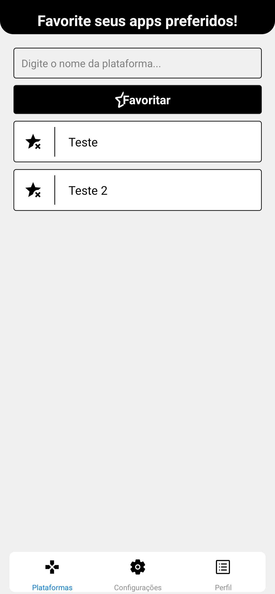
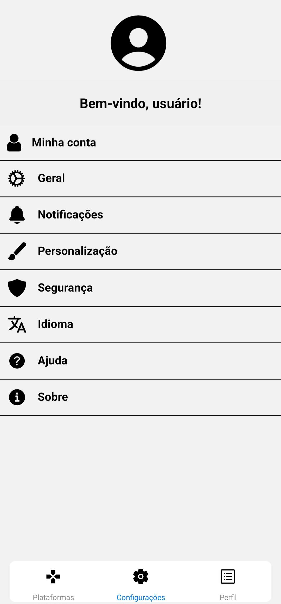
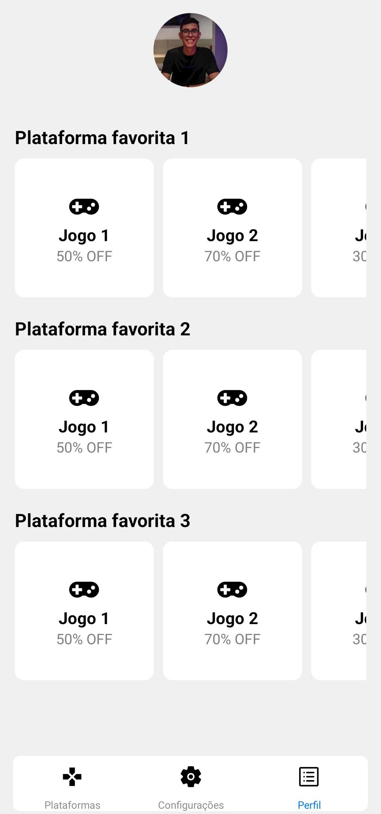

# ProjetoMobileCoding
 
# Game Discount App

O DeskGames App é um aplicativo para dispositivos móveis que ajuda os jogadores a encontrar e aproveitar descontos em jogos para várias plataformas. Com uma interface intuitiva e fácil de usar, o aplicativo oferece uma maneira conveniente de descobrir e acompanhar as melhores ofertas em jogos.

## Recursos Principais

- **Descontos em Tempo Real:** O aplicativo exibe os descontos atualizados em "tempo real" para várias plataformas de jogos, incluindo Steam, Epic Games, PlayStation e Xbox.

- **Navegação por Plataforma:** Os usuários podem explorar os descontos por plataforma, facilitando a busca de ofertas específicas para a plataforma de sua preferência.

- **Notificações Personalizadas:** Os usuários podem configurar notificações personalizadas para receber alertas sobre descontos em jogos de seus interesses ou plataformas favoritas.

## Capturas de Tela

## Como Contribuir

Contribuições são bem-vindas! Se você deseja contribuir para o desenvolvimento do Game Discount App, siga estas etapas:

1. Faça um fork deste repositório e clone-o para o seu ambiente local.
2. Crie uma nova branch para suas alterações: `git checkout -b feature/nova-funcionalidade`.
3. Faça suas alterações no código, adicionando novos recursos ou corrigindo problemas.
4. Faça commit das suas alterações: `git commit -m 'Adicionar nova funcionalidade'`.
5. Envie suas alterações para o seu fork: `git push origin feature/nova-funcionalidade`.
6. Abra um pull request neste repositório, descrevendo suas alterações e explicando os benefícios que elas trazem.

